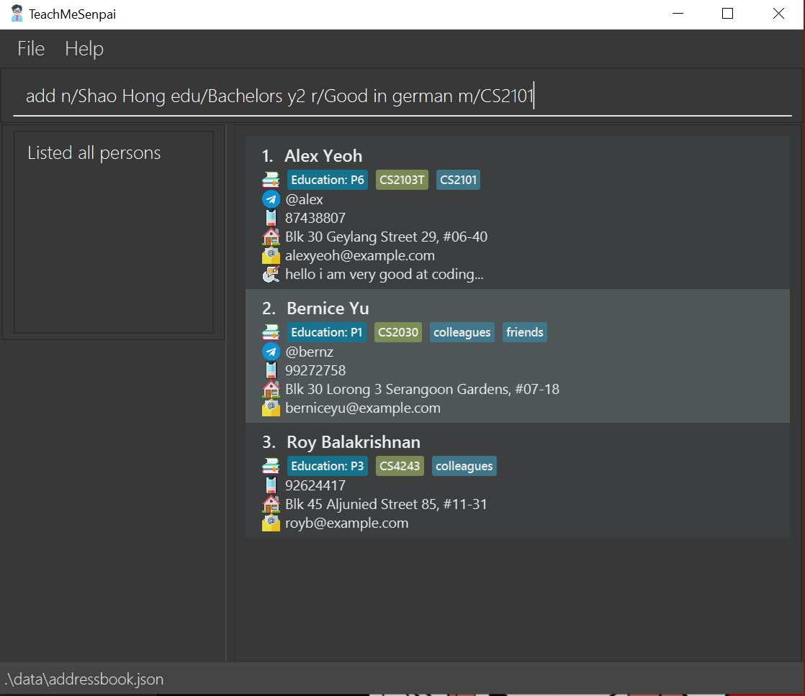

* Table of Contents
{:toc}

---

TeachMeSenpai is a **desktop app targeted at private academic tutors who have many students to keep track of.** It is tailored to assist the user in monitoring their schedule, students' progress, and details.

## Quick start

1.  Ensure you have `Java 11` or above installed in your Computer.
2.  Download the latest `teachmesenpai.jar` from [here](https://github.com/AY2223S2-CS2103T-W12-2/tp/releases/latest).
3.  Copy the file to the folder you want to use as the home folder for your application.
4.  Double-click the file to start the app.

## Features

<ins>:bulb: **Notes about the command format:**</ins>

-   Words in `UPPER_CASE` are the parameters to be supplied by the user.  
    _(eg. in `add n/NAME`, `NAME` is a parameter which can be used as `add n/John Doe`)_

-   Items in square brackets are optional.  
    _(eg. `n/NAME [t/TAG]` can be used as `n/John Doe t/friend` or as `n/John Doe`)_

-   Items with `...` after them can be used multiple times including zero times.  
    _(eg. `[t/TAG]...` can be excluded completely, or once `t/friend`, or twice `t/friend t/family`, etc.)_

-   Parameters can be in any order.  
    _(eg. if the command specifies `n/NAME p/PHONE_NUMBER`, `p/PHONE_NUMBER n/NAME` is also acceptable)_

-   If a parameter is expected only once in the command but you specified it multiple times, only the last occurrence of the parameter will be taken.  
    _(eg. if you specify `p/12341234 p/56785678`, only `p/56785678` will be taken)_

-   Extraneous parameters for commands that do not take in parameters (such as `help`, `list`, `exit` and `clear`) will be ignored.  
    _(eg. if the command specifies `help 123`, it will be interpreted as `help`)_

### Viewing help: `help`

Shows a URL to the `User Guide` page.

### Exiting the program: `exit` / `bye` / `quit`

Exits the program.

> Format: `exit`

:bulb: **Note:** This is the same as closing the app via the top-right `x` button.

### Listing all students: `list`

Shows a list of the saved all students.

> Format: `list`

### Adding a student: `add`

Adds a student to the list, along with their education level and any student-specific notes.

> Format: `add n/STUDENT_NAME [a/ADDRESS] [p/PHONE_NUM] [e/EMAIL] [edu/EDUCATION_LEVEL] [r/REMARK] [t/TAG]... [s/SUBJECT]...`

Examples:

- `add n/Shaun a/123 NUS Street r/Good in Japanese t/submitted`
- `add n/Shao Hong edu/Bachelors y2 r/Good in German s/German`
- `add n/Wen Li e/e07123456@u.nus.edu p/91234567 a/696 PGPR r/毎日3回うんこをとります`

  
_**Above: Before entering `add` command**_

  
_**Above: After entering `add` command**_

### Delete a student: `delete`

Deletes the specified student from the address book.

> Format: `delete INDEX`

- Deletes the student at the specified `INDEX`.
- The index refers to the index number shown in the displayed student list.
- The index **must be a positive integer** 1, 2, 3, ...

Examples:

- `list` followed by `delete 2` deletes the 2nd student in the address book.

  
_**Above: Before entering `delete` command**_

  
_**Above: After entering `delete` command**_

### Saving the data

TeachMeSenpai data are saved in the hard disk automatically after any command that changes the data. There is no need to save manually 🙂

### Editing the data file

> ❗ **Caution:** If your changes to the data file makes its format invalid, TeachMeSenpai will discard all data and start with an empty data file at the next run.

---

# Command summary

| Action | Format, Examples                                                                                |
| ------ | ----------------------------------------------------------------------------------------------- |
| Add    | `add n/STUDENT_NAME a/ADDRESS o/NOTES` eg. `add n/Shaun a/123 NUS Street o/Good in Japanese` |
| Delete | `delete INDEX` eg. `delete 3`                                                                |
| Exit   | `exit`, `bye`, `quit`                                                                           |
| List   | `list`                                                                                          |
